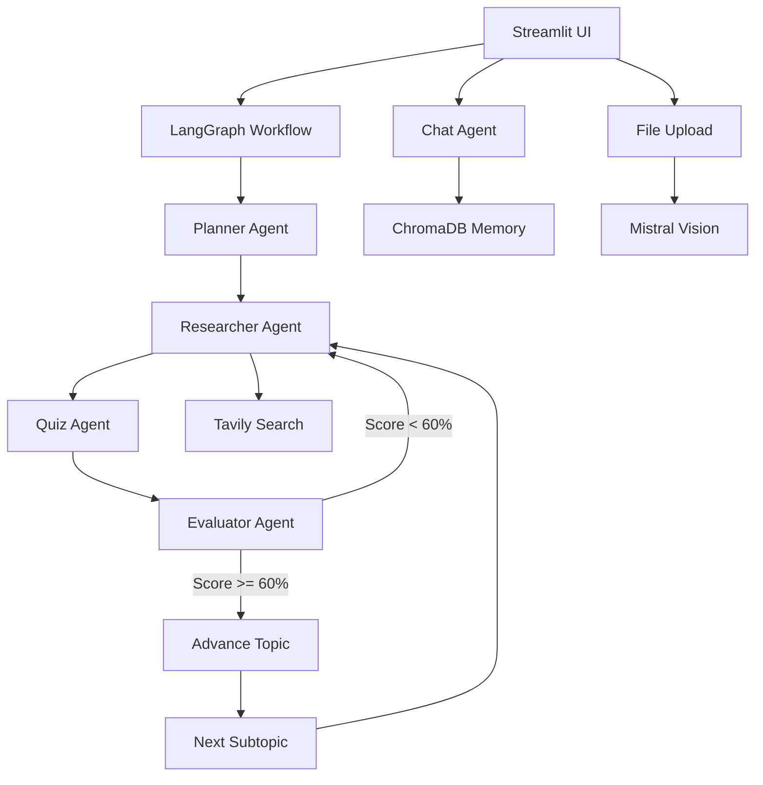
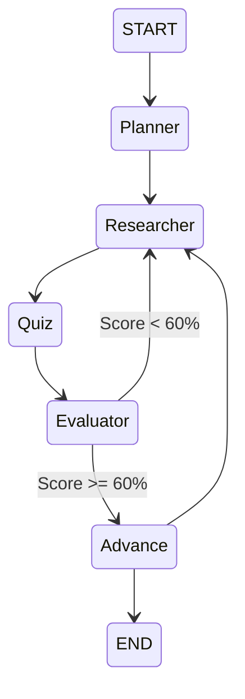

# 🎓 AI Study Buddy

<p align="center">


</p>


<p align="center">
An intelligent multi-agent AI learning assistant that plans, researches, quizzes, evaluates, and tracks your learning journey.
</p>


---

# 📚 Table of Contents

- [Project Overview](#-project-overview)
- [Features](#-features)
- [Security Guardrails](#-security-guardrails)
- [Architecture](#-architecture)
- [Setup Instructions](#-setup-instructions)
- [AI Agents](#-ai-agents)
- [LangGraph Workflow](#-langgraph-workflow)
- [How To Use](#-how-to-use)
- [Memory System](#-memory-system)
- [File Upload & Vision](#-file-upload--vision)
- [Export System](#-export-system)
- [Project Structure](#-project-structure)
- [Evaluation Checklist](#-evaluation-checklist)
- [Sample Outputs](#-sample-outputs)
- [Troubleshooting](#-troubleshooting)


---

# 🌟 Project Overview

**AI Study Buddy** is an agentic AI-powered learning assistant designed to provide a complete personalized study workflow.

The system can:

- Generate long-term study plans
- Research learning materials
- Create quizzes automatically
- Evaluate student performance
- Identify weak areas
- Trigger re-learning loops
- Maintain long-term memory
- Answer academic questions conversationally


Built using:

| Component | Technology |
|-|-|
| User Interface | Streamlit |
| Agent Framework | LangGraph |
| Language Model | Mistral AI API |
| Vector Memory | ChromaDB |
| Web Research | Tavily Search |
| Document Processing | PyPDF2, python-docx |
| Vision Model | Mistral Pixtral |


---

# ✨ Features


| Feature | Description |
|-|-|
| 🛡️ Security Guardrails | Prompt injection defense, PII masking, academic filtering |
| 🗺 Planner Agent | Generates personalized multi-day learning plans |
| 📚 Research Agent | Creates structured study notes |
| ❓ Quiz Agent | Generates MCQs from learning material |
| 📊 Evaluator Agent | Scores answers and provides feedback |
| 🔄 Feedback Loop | Automatically triggers re-study |
| 💬 Chat Assistant | Memory-aware academic chatbot |
| 🧠 Vector Memory | Persistent ChromaDB knowledge storage |
| 📁 File Upload | PDF, DOCX, TXT and image support |
| 👁 Vision Support | Image understanding using Pixtral |
| 📥 Export | JSON and PDF downloads |
| 🖥 Streamlit UI | Complete browser-based interface |


---

# 🛡️ Security Guardrails

All user inputs and AI outputs pass through multiple security layers.

Location:

```
utils/guardrails.py
```


## 1. Prompt Injection Defense

Detects malicious instructions:

Examples:

```
ignore previous instructions
act as admin
developer mode
jailbreak
system override
```

Applied before every LLM request.


---

## 2. PII Redaction

Automatically removes:

- Email addresses
- Phone numbers
- Credit card numbers
- SSN patterns
- Sensitive identifiers


Example:

```
john@gmail.com

↓

[EMAIL_REDACTED]
```


---

## 3. Academic-Only Filtering

The assistant only accepts educational queries.

Supported domains:

- Programming
- Mathematics
- Science
- Engineering
- Computer Science
- Academic subjects


Uses:

```
Regex word boundary matching (\b)
```

to avoid false detections.


---

## 4. Output Validation

Optional checks for:

- System prompt leakage
- API keys
- Internal paths
- Sensitive information


---

## 5. Tool Schema Enforcement

All external tool calls are validated using structured schemas.

Example:

```
Tavily Search Request
        |
        ↓
Pydantic Validation
        |
        ↓
Web Search
```


---

# 🏗 Architecture





---

# 🚀 Setup Instructions


## 1. Clone Repository

```bash
git clone <repository-url>

cd ai_study_buddy
```


---

## 2. Create Virtual Environment

```bash
python -m venv venv
```


Activate:


### Windows

```bash
venv\Scripts\activate
```


### Linux/Mac

```bash
source venv/bin/activate
```


---

## 3. Install Dependencies

```bash
pip install -r requirements.txt
```


Optional:


```bash
pip install reportlab

pip install pillow pytesseract
```


---

## 4. Configure API Keys


Create:

```
.env
```


Add:


```env
MISTRAL_API_KEY=your_key_here

TAVILY_API_KEY=your_key_here

MISTRAL_MODEL=mistral-medium-latest
```


---

## 5. Run Application


```bash
streamlit run app.py
```


Open:

```
http://localhost:8501
```


---

# 🤖 AI Agents


## 🗺 Planner Agent


File:

```
agents/planner_agent.py
```


Function:

```python
run_planner()
```


Responsibilities:

- Generates study roadmap
- Creates daily objectives
- Defines concepts
- Suggests resources
- Generates practice tasks


Example:

```
Machine Learning

Day 1:
Introduction

Day 2:
Regression

Day 3:
Classification
```


---

# 📚 Researcher Agent


File:

```
agents/researcher_agent.py
```


Responsibilities:

- Web search
- Document analysis
- Knowledge extraction
- Structured notes generation


Output:

```
Overview

Key Concepts

Detailed Explanation

Summary
```


---

# ❓ Quiz Agent


File:

```
agents/quiz_agent.py
```


Creates:

- Multiple Choice Questions
- Answer Keys
- Explanations


Example:

```
Question:
What is supervised learning?

A. Learning without labels

B. Learning using labeled data

C. Random search

D. Data compression
```


---

# 📊 Evaluator Agent


File:

```
agents/evaluator_agent.py
```


Responsibilities:

- Evaluate answers
- Calculate score
- Provide feedback
- Trigger revision


Logic:

```
Score < 60%

        |
        ↓

Research weak areas again

        |
        ↓

Retry Quiz
```


Maximum retries:

```
2
```


---

# 💬 Chat Agent


File:

```
agents/chat_agent.py
```


Features:

- Short-term conversation memory
- ChromaDB retrieval
- Context-aware responses
- Academic filtering


Flow:

```
User Question

↓

Guardrails

↓

Retrieve Memory

↓

Mistral API

↓

Response Validation

↓

Answer
```


---

# 🔄 LangGraph Workflow





---

# 🧠 Memory System


Powered by:

```
ChromaDB
```


Stores:

- Research notes
- Quiz results
- Study plans
- Conversations


Storage:

```
chroma_db/
```


Persistent state:

```
data/study_buddy_state.json
```


---

# 📁 File Upload & Vision Support


Supported formats:

| Type | Processing |
|-|-|
| PDF | PyPDF2 |
| DOCX | python-docx |
| TXT | Text parser |
| Images | Mistral Pixtral Vision |


Uploaded files:

```
uploads/
```


Pipeline:


```
Upload File

↓

Extract Content

↓

Summarize

↓

Store in ChromaDB

↓

Available to Agents
```


---

# 📥 Export System


Supported:

## JSON Export

Includes:

- Study plans
- Research
- Quiz results
- Conversations


## PDF Export

Generated using:

```
reportlab
```


---

# 🖥 Application Usage


## Dashboard

Features:

- Quick actions
- Search bar
- Navigation


---

## Study Planner


Input:

```
Topic
Duration
Difficulty
```


Output:

```
Multi-day learning roadmap
```


---

## Research


Choose:

☑ Web Search

☑ Uploaded Documents


Generate:

```
Structured Learning Notes
```


---

## Quiz


Steps:

1. Select topic
2. Generate questions
3. Submit answers
4. Receive evaluation


---

## Chat


Ask academic questions:

Example:

```
Explain convolutional neural networks
```


Blocked:

```
Tell me a joke
```


---

# 📁 Project Structure


```
ai_study_buddy/

│

├── app.py

├── graph.py

├── config.py

├── requirements.txt

│

├── agents/

│   ├── planner_agent.py

│   ├── researcher_agent.py

│   ├── quiz_agent.py

│   ├── evaluator_agent.py

│   └── chat_agent.py

│

├── tools/

│   └── search_tool.py

│

├── memory/

│   └── vector_store.py

│

├── utils/

│   ├── llm_client.py

│   ├── file_extractor.py

│   ├── pdf_generator.py

│   └── guardrails.py

│

├── uploads/

│

└── chroma_db/
```


---

# ✅ Evaluation Checklist


| Requirement | Status |
|-|-|
| Multi-Agent Architecture | ✅ |
| LangGraph Workflow | ✅ |
| Tool Integration | ✅ |
| Web Search | ✅ |
| Persistent Memory | ✅ |
| Vision Support | ✅ |
| PDF Export | ✅ |
| JSON Export | ✅ |
| Security Middleware | ✅ |
| Feedback Loop | ✅ |


---

# 📝 Sample Output


## Study Plan


```
Day 1

Topic:
Introduction to Machine Learning


Objectives:

Understand ML fundamentals


Practice:

Load dataset using Python
```


## Quiz Result


```
Score: 4/5

Accuracy: 80%

Status: PASSED


Feedback:

Review precision and recall concepts.
```


---

# 🔧 Troubleshooting


<details>

<summary>Mistral API Error</summary>


Check:

```
.env
```


Verify:

```
MISTRAL_API_KEY
```


</details>


<details>

<summary>PDF Export Failed</summary>


Install:


```bash
pip install reportlab
```

</details>


<details>

<summary>Guard Blocking Valid Topics</summary>


Add missing keywords in:


```
utils/guardrails.py
```


</details>


<details>

<summary>Streamlit Cache Problems</summary>


Remove:


```
__pycache__
```


Restart application.

</details>


---

# 👨‍💻 Technology Stack


```
Frontend
 |
 └── Streamlit


AI Layer
 |
 └── Mistral API


Agent Framework
 |
 └── LangGraph


Memory
 |
 └── ChromaDB


Search
 |
 └── Tavily


Security
 |
 └── Custom Guardrails
```


---

# ⭐ Future Improvements

- Personalized adaptive learning
- Voice interaction
- Multi-language tutoring
- Mobile application
- Federated learning memory
- Advanced analytics dashboard


---

<p align="center">

⭐ If you find this project useful, consider starring the repository ⭐

</p>
